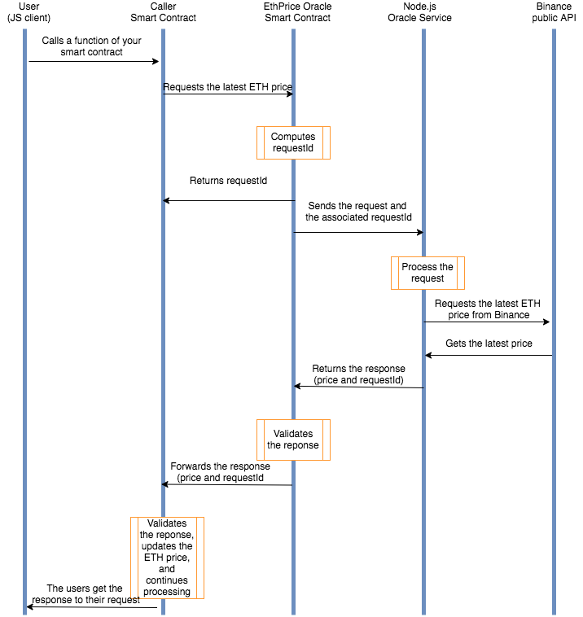
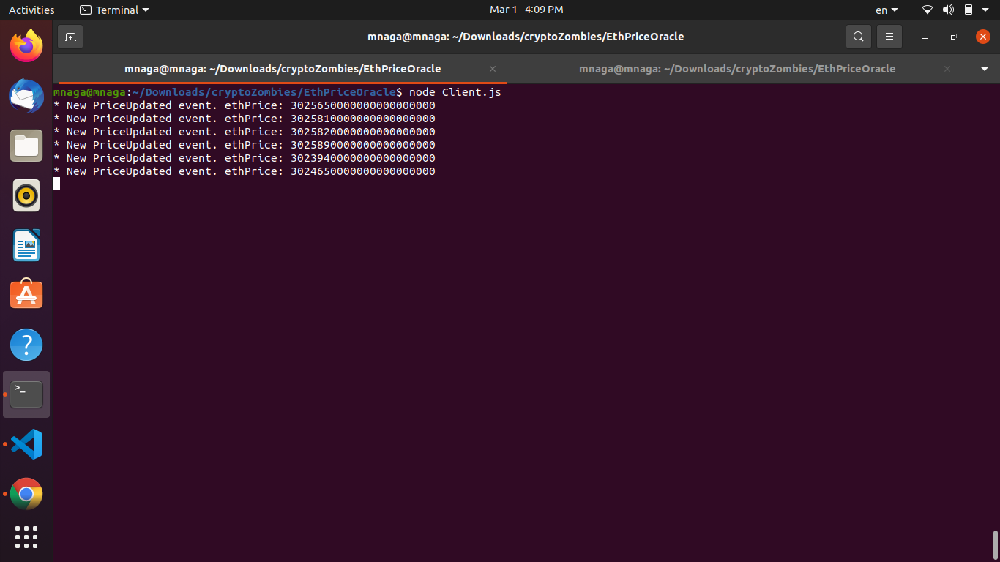

# ETH/USD Price Oracle

- ETH/USD price oracle that fetches answers using Binance's public API.
- I built this following CryptoZombies tutorials.
  
## Instructions:
- npm install
- In one ternminal, run: node EthPriceOracle.js
- In another terminal, run: node Client.js

## Workflow:
  
Image credit: CryptoZombies

## Output:
  
